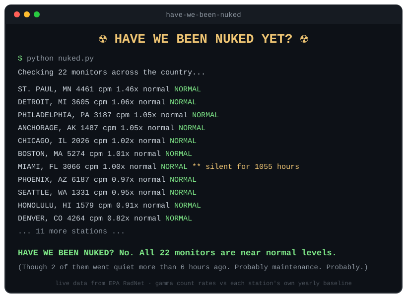

# ☢️ Have We Been Nuked Yet?

A command-line program that answers the question on everyone's mind — using **real, live radiation data** from the EPA's [RadNet](https://www.epa.gov/radnet) network of gamma monitors across the United States.

It's a joke. But the data is real, the anomaly detection is real, and if a monitor ever *does* read ten times its normal level, this program will be among the first to tell you. (Please also check the news.)



## What it does

With no arguments, it sweeps 22 RadNet monitors spread across the country (Anchorage to Miami, Honolulu to Boston) concurrently, in a few seconds:

```
python nuked.py
```

Or check a single monitor:

```
python nuked.py CO DENVER
```

## How the detection works

Every station is compared against **its own history**, not a fixed threshold — background radiation in Phoenix idles at ~6,400 counts per minute while Seattle idles at ~1,400, so no single number works for both. For each station the program downloads the year's hourly gamma count rates and computes the mean and standard deviation, then judges the latest reading:

| Verdict | Condition |
|---|---|
| **NUKE** | Latest reading ≥ 10× the station's mean |
| **SPILL** | ≥ 10 standard deviations above the mean **and** ≥ 1.5× the mean |
| **NORMAL** | Anything else |

The spill test needs both conditions on purpose: the standard-deviation test stops a naturally noisy station's routine swings from raising alarms, and the ratio test stops a hyper-stable station from panicking over a tiny blip. Rain washing radon out of the sky (a real effect that raises readings ~1.5×) stays safely below both bars.

It also flags monitors that have **stopped reporting** — a station silent for days would otherwise let us cheerfully declare "not nuked" from stale data, which is arguably the funniest possible failure mode:

```
MIAMI, FL            3066 cpm   1.00x normal  NORMAL   ** silent for 1055 hours
```

## Exit codes

Scriptable, for your cron-job doomsday needs:

| Code | Meaning |
|---|---|
| 0 | All monitors normal |
| 1 | Possible spill |
| 2 | Possible nuke |
| 3 | No data from any monitor (either the internet is down... or, uh oh) |

## Running it

No dependencies — Python 3.8+ standard library only.

```
python nuked.py              # national sweep
python nuked.py TX AUSTIN    # one station
python nuked.py --help
python -m unittest           # run the tests (no network needed)
```

## Data source

Hourly near-real-time gamma count rates from the EPA RadNet fixed monitor network:
`https://radnet.epa.gov/cdx-radnet-rest/api/rest/csv/{year}/fixed/{STATE}/{CITY}`

Timestamps are GMT. Some stations report dose equivalent rate too, but this program uses the raw gamma count channels (R02–R09) because every station reports those.

## Disclaimer

This is a toy. It is **not** an emergency-alert system, and you should not make any safety decision based on its output. If you are genuinely concerned about a radiological event, consult official channels: [ready.gov/radiation](https://www.ready.gov/radiation) and your local emergency management agency.

## License

Everything in this repository from this change on is under the
[PolyForm Noncommercial License 1.0.0](LICENSE), apart from the third-party
material listed in [NOTICE](NOTICE), which keeps its own terms. Earlier commits were released
under the Apache License 2.0 and stay under it. In plain terms: it is free for
any noncommercial purpose, and for schools and universities, public research
organizations, government institutions and charities, whatever their funding.
Commercial use needs a license from the author: ask through
[the issue tracker](https://github.com/MichaelFowler1/have-we-been-nuked/issues). Anyone who
passes on a copy has to pass on the license and the `Required Notice:` line in
[NOTICE](NOTICE). This is a plain summary; the LICENSE file is what governs.
